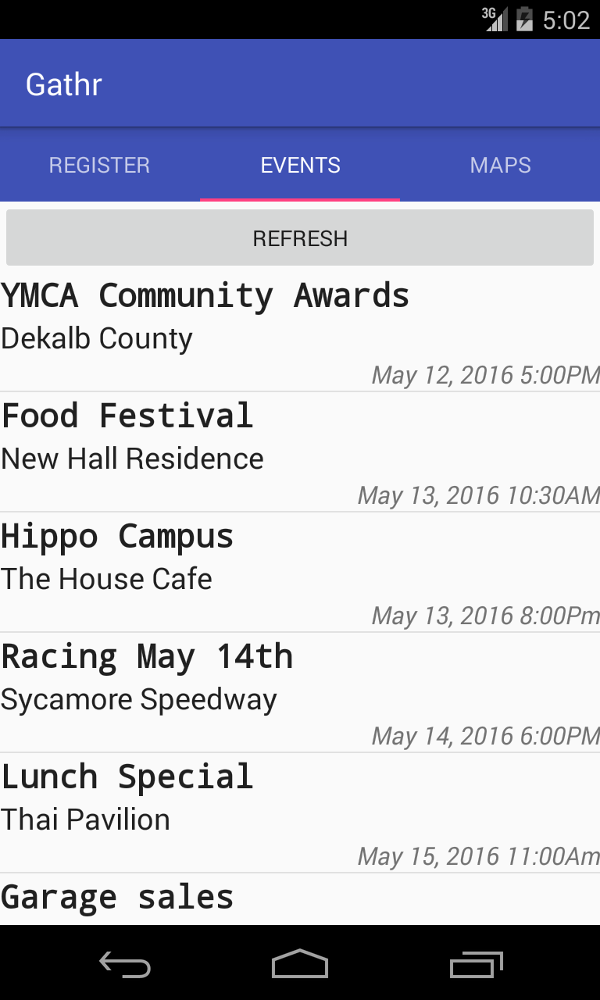
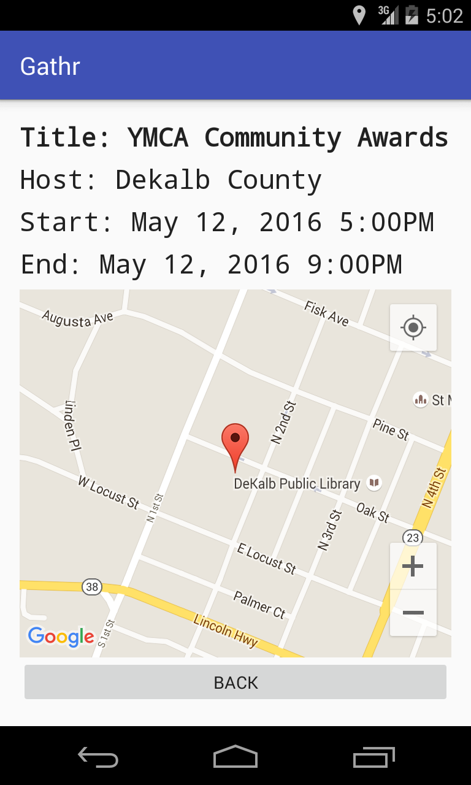
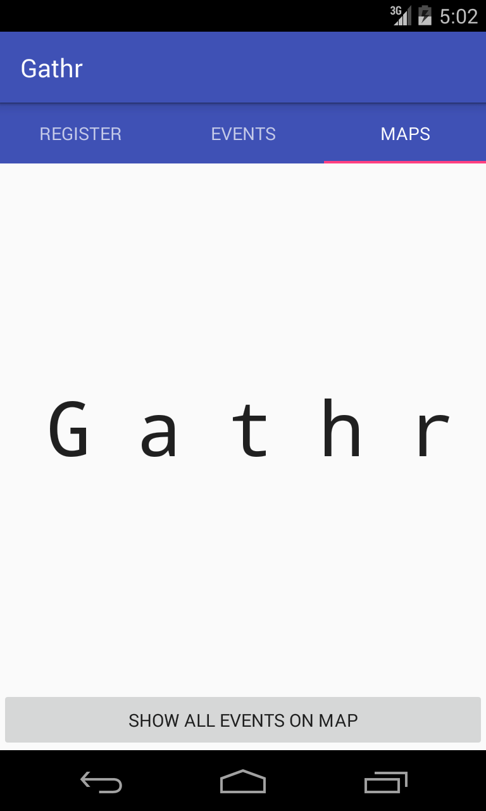
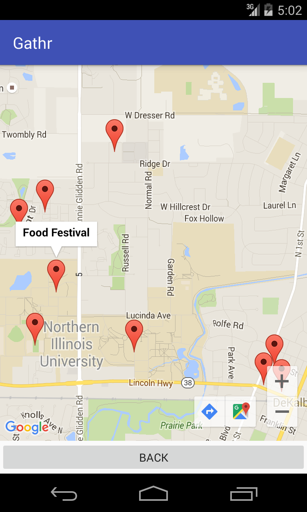
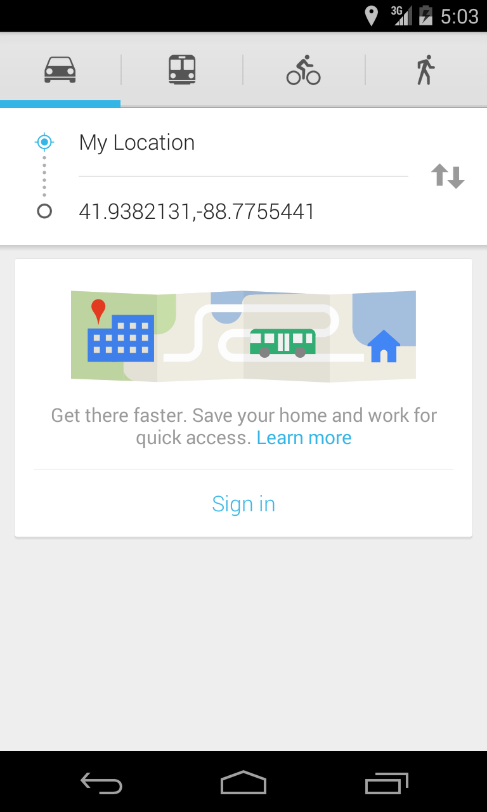

# Gathr

Find things to do, wherever you go!  

Gathr is an Android app written in Java and Parse.com for storage.  

## Screenshots   
   
   
 

## About Gathr   
Gathr uses your location to find events around you in an easy to display list, or view the map to see how close local events are to your location! Have an event that you would like to host? You can easily add it to the map! Simply create event to add your own event that will show up to all the users around your location.
