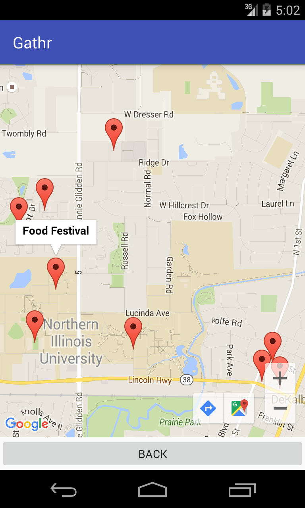

### Welcome to GitHub Pages.
This automatic page generator is the easiest way to create beautiful pages for all of your projects. Author your page content here [using GitHub Flavored Markdown](https://guides.github.com/features/mastering-markdown/), select a template crafted by a designer, and publish. After your page is generated, you can check out the new `gh-pages` branch locally. If you’re using GitHub Desktop, simply sync your repository and you’ll see the new branch.

# Gathr

Find things to do, wherever you go!  

Gathr is an Android app written in Java and Parse.com for storage.  

## Screenshots   
   
   
 

## About Gathr   
Gathr uses your location to find events around you in an easy to display list, or view the map to see how close local events are to your location! Have an event that you would like to host? You can easily add it to the map! Simply create event to add your own event that will show up to all the users around your location.

### Support or Contact
Having trouble with Pages? Check out our [documentation](https://help.github.com/pages) or [contact support](https://github.com/contact) and we’ll help you sort it out.
